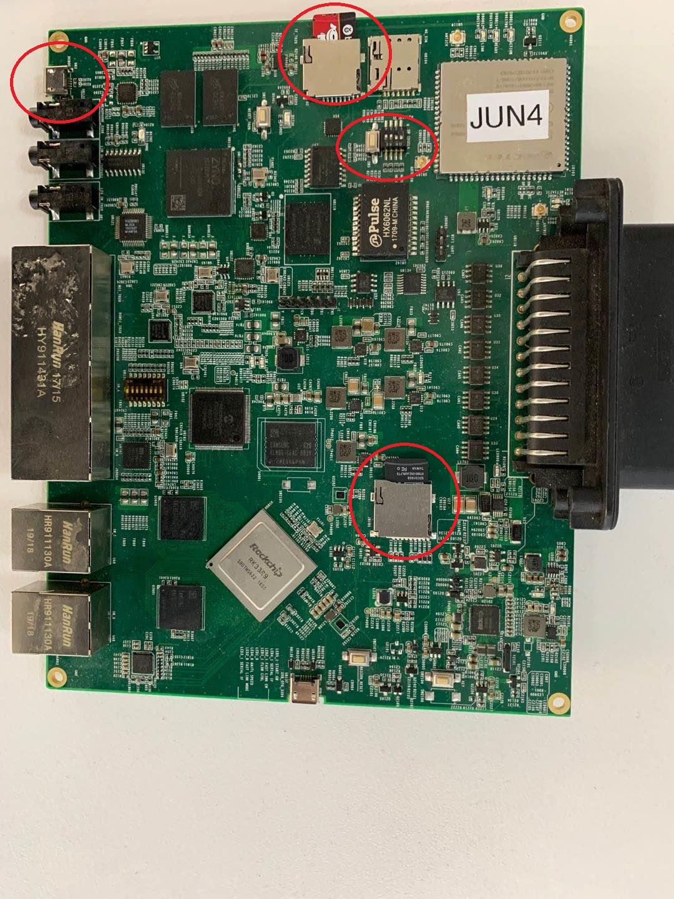

# zq_7020&rk3399板卡部署系统说明

## 1) 将研发部门转入的启动卡分别如下图所示插入相应的卡槽

* 请注意启动卡的颜色
* 请注意拨码开关的位置 为 
  | 1|on
  |--|--
  | 2|on
  | 3|off
  | 4|off
* 将micro-usb的线一端插入图中画圈的插口中，推荐使用win10，在设备管理器中会有两个新的串口枚举出来

## 2)上电
* 使用secure_crt或者putty登录设备

* 进入emmc_tools目录，执行操作

* 等待控制台输出success

## 3)断电，重新启动
* 将拨码开关的位置 切换为
  | 1|off
  |--|--
  | 2|on
  | 3|off
  | 4|off

